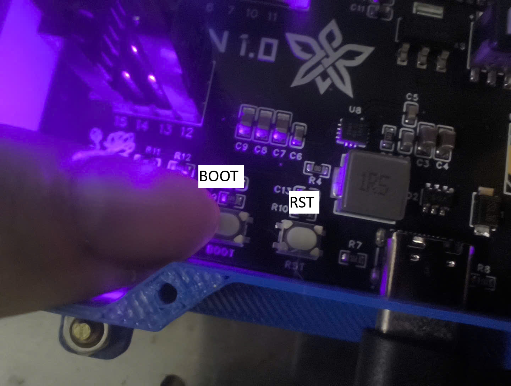

# Hướng dẫn nạp code

## Bước 1: Kết nối mạch vào máy tính
    -   Trong Kit có 2 dây sạc ngắn, 1 dây sạc dài, chỉ dùng dây dài mới có thể nạp code
    -   Cắm dây nối máy tính vào mạch, đảm bảo đèn trên mạch sáng và dây cắm chắc

## Bước 2: Đưa mạch vào chế độ nạp code

    -   Giữ cả 2 nút BOOT và RST
    -   Thả nút RST trước
    -   Sau đó thả nút BOOT

## Bước 3: Nạp code
    -   Làm theo video hướng dẫn